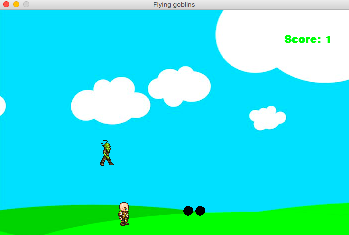

## Overview
This is my first attempt at creating a flying goblins game using Pygame and my first attempt at using Pygame. Any questions or suggestions are welcomed. The objective is to kill as many goblins as you can while avoiding any of the goblins from hitting you.

## Running the game
To run the game first clone the repository and run pythonGame.py. Make sure you have pygame installed as well as the math and random packages.

## How the game works:

Goblins fall from the sky and travel down in a straight path. Their initial position and slope of travel is generated randomly. 
    
You can walk around using the "left" and "right" keys as well as jump by pressing "z".
    
You can fire bullets using the "space" key. Only 20 bullets can be shot at a time. The initial positon of the bullet is where you are at when you fired it. If you are standing still while firing the bullet, the bullet will travel in the direction you are facing unless you are pressing the "up" key in which case the bullet will travel straight upward. If you are moving (ie: the "left" or "right" key is being pressed) while firing the bullet, the bullet will travel in the direction you are moving in and also upwards if the "up" key is pressed. For example if you are pressing the "left" key while firing the bullet will travel straight to the left. If you are pressing the "left" key and the "up" key at the same time, the bullet will travel left and up at a slope of -1.

###### The goblins fall from the sky more frequently as the game goes on.

- In the first two minutes, goblins fall at an rate of 1 every 5 seconds.

- Between two and three minutes goblins fall at an rate of 1 every 3 seconds.

- Between three and four minutes goblins fall at an rate of 1 every 2 seconds.

- Between four and five minutes goblins fall at an rate of 1 every second.

- After 5 minutes, 5 goblins fall every second.
